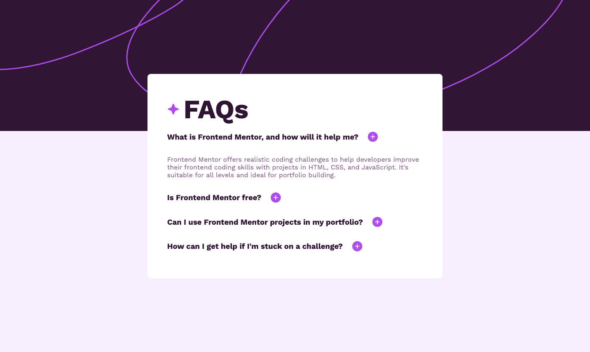

# Frontend - FAQ accordion solution

This is a solution to the [FAQ accordion challenge on Frontend Mentor](https://www.frontendmentor.io/challenges/faq-accordion-wyfFdeBwBz).

### Challenges

- Easily hide/show answers to questions by clicking on the respective question.
- Provide seamless keyboard navigation for users to navigate through questions and toggle answers effortlessly.
- Ensure an optimal layout that adapts to the screen size of the user's device, delivering a consistent and enjoyable user experience.
- Enhance user interaction by implementing hover and focus states for all interactive elements on the page.

### Screenshot



### Links

- Live Site URL: [Add live site URL here](https://faq-accordion-six-eosin.vercel.app/)

## My process

- Started by crafting the HTML layout, defining the structure of the page.
- Explored techniques to position divs over each other for a visually appealing design.
- Created the framework for questions and their corresponding answers in a structured manner.
- Encountered difficulties in JavaScript, particularly with hover effects and dynamically adding icons within a flex container.
- Applied problem-solving strategies to address JavaScript challenges, ensuring successful implementation of hover states and dynamic icon changes.

### Built with

- HTML5
- CSS
- JavaScript
- Flexbox

### What I learned

Successfully structured the HTML layout, experimented with overlay techniques for visual appeal, developed a framework for organized Q&A, faced and addressed JavaScript challenges, honed problem-solving skills for improved troubleshooting.

# Getting started
For starting this in your machine, open the terminal and follow these commands:

git clone the repo
```
git clone https://github.com/Vinayy-B/frontEnd.git
```

cd into working directory
```
cd faq-accordion-main
```

open http://localhost:3000 in browser to run.